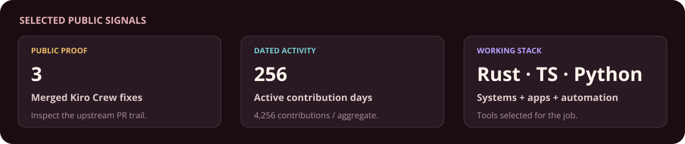
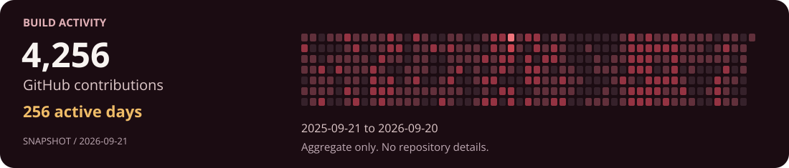
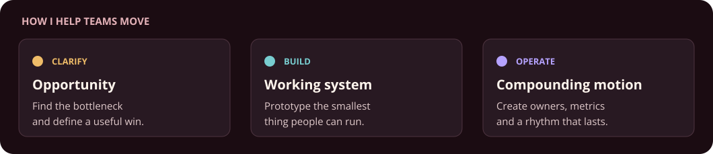
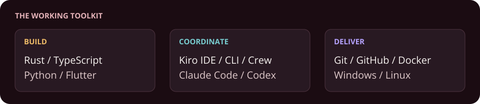

<picture>
  <source media="(prefers-reduced-motion: reduce)" srcset="assets/option-verse-portal-static.svg">
  
</picture>

  <a href="https://x.com/ZippyNetworks">Follow the build notes</a> ·
  <a href="https://www.youtube.com/@zippytechnologies">Watch walkthroughs</a> ·
  <a href="https://www.linkedin.com/in/gozippy/">Work with me</a> ·
  <a href="https://github.com/GoZippy?tab=repositories">Public repositories</a>

**I build AI systems that turn ambitious ideas into working operations.**

I'm **Eric Henderson** — most people call me **Zippy**. I'm a builder, operator and serial entrepreneur working across AI tools, distributed infrastructure and persistent worlds at **Zippy Technologies**. I'm also a **[Kiro Ambassador](https://kiro.dev/ambassadors/)**, regularly building with Kiro IDE, CLI and Crew.

**Now:** testing multi-provider agent workflows, hardening Windows reliability and turning the work into practical public walkthroughs.

### Featured public proof

**Memory-aware agent capacity on Windows** · [Merged into Kiro Crew #6341](https://github.com/kirodotdev/KiroCrew/pull/6341)

- **Problem:** agent capacity could outpace the memory available on Windows.
- **Change:** factor real available memory into the subagent cap.
- **Status:** merged upstream on August 27, 2026.

Reliable automation starts with honest resource limits. The public pull request lets you inspect the implementation and review trail directly.

<b>Build activity — dated contribution snapshot</b>

<!-- ACTIVITY:START -->
**4,256 contributions · 256 active days** · 2025-09-21 to 2026-09-20. Snapshot: 2026-09-21.
<!-- ACTIVITY:END -->

These are GitHub **contributions**, not a count of commits, hours worked or code quality. The snapshot reflects activity visible to the authorized account, which can include private work. Only aggregate counts and dates are exported; private repository names, URLs, branches and commit messages are never requested by the activity collector.

### How I can help

Bring me a workflow, product or operation that is stuck. I help clarify the opportunity, build the smallest useful system and establish an operating rhythm around it.

[Bring me a bottleneck on LinkedIn](https://www.linkedin.com/in/gozippy/) · [Reply to a build note on X](https://x.com/ZippyNetworks)

<b>Ways I can help — integration, operations & strategy</b>

- **AI integration & automation:** map a bottleneck, choose the right tools and ship a measurable pilot.
- **Fractional CTO / COO:** turn product and operations priorities into a sequenced plan, owners and a review rhythm.
- **Strategic advisory & ecosystems:** connect technical direction, partnerships, education and contributor growth.

### Inside the workshop

Six project families show how the systems, agent operations, worlds, real-world products and development tools connect. Inclusion shows portfolio scope, not release status. The expandable lanes below provide deeper context for selected core work.

<b>01 · Compute — ZippyCoin, ZippyMesh & LLM Router</b>

| Project | Status | Direction |
| --- | --- | --- |
| **ZippyCoin** | Public entry / WIP | Blockchain and settlement work. The [public project entry](https://github.com/GoZippy/zippycoin-public) is not a full source release. |
| **ZippyMesh** | WIP | Distributed compute and the connections between nodes. |
| **ZippyMesh LLM Router** | WIP | Model-provider routing and the tools around it. |

Work-in-progress labels do not imply that every integration is released.

<b>02 · Worlds — ZippyVerse, Orbit3D & Persistent World Studio</b>

| Project | Status | Direction |
| --- | --- | --- |
| **ZippyVerse** | Exploration | Persistent-world and game experiments. |
| **Orbit3D / ZippyVerse game v2** | WIP | The next game iteration and its interactive world. |
| **Persistent World Studio** | WIP | Engine, editor and agent-assisted production tooling for long-running worlds. |

The illustrations are concepts. Actual builds, limitations and walkthroughs belong in the [video series](https://www.youtube.com/@zippytechnologies).

<b>03 · Agents — Kiro Crew, AutoClaw & ZippyAgent Mobile</b>

| Work | Status | Direction |
| --- | --- | --- |
| **Kiro IDE + CLI + Crew** | Public contributions | Everyday build tools and a focus of my ambassador walkthroughs. |
| **AutoClaw** | WIP | Agent coordination, claims, review and execution workflows. |
| **ZippyAgent Mobile** | WIP | Mobile attention and approval surfaces for the wider workshop. |

[My Kiro Crew fork](https://github.com/GoZippy/KiroCrewPublic) · [Upstream Kiro Crew](https://github.com/kirodotdev/KiroCrew) · [Kiro Ambassador program](https://kiro.dev/ambassadors/)

Credit belongs to the upstream project and its contributors. My fork and Zippy tools are distinct from official Kiro products.

### More public proof

Also merged into [Kiro Crew](https://github.com/kirodotdev/KiroCrew):

- **Tailscale coexistence:** handle configurations serving other ports. [#7999](https://github.com/kirodotdev/KiroCrew/pull/7999)
- **Windows test accuracy:** declare the tests that need real symlinks. [#6752](https://github.com/kirodotdev/KiroCrew/pull/6752)

More public work and proposals

**Under review, not merged as of September 20, 2026:** [Windows Task Scheduler supervision #11289](https://github.com/kirodotdev/KiroCrew/pull/11289) and [cautious boot recovery #11288](https://github.com/kirodotdev/KiroCrew/pull/11288).

**Owned project:** [DockerRescueKit](https://github.com/GoZippy/DockerRescueKit), for Docker backup and restore workflows. Its merged [backup browsing and storage visibility work #87](https://github.com/GoZippy/DockerRescueKit/pull/87) is an example of maintenance with a concrete user-facing result.

Project ownership, forks and external contributions are different kinds of work. These links let you inspect each one directly.

<b>Tools I build with</b>

**Systems & applications** · Rust · TypeScript · Python · Flutter / Dart

**Build & delivery** · Docker · Git · GitHub · Windows / Linux

**Agent workflows** · Kiro IDE · Kiro CLI · Kiro Crew · Claude Code · Codex

---

**Follow the build:** practical lessons, honest work in progress and useful tools as they ship. [Follow on X](https://x.com/ZippyNetworks) · [Connect on LinkedIn](https://www.linkedin.com/in/gozippy/) · [Watch the walkthroughs](https://www.youtube.com/@zippytechnologies)

Eric Henderson · Zippy Technologies · [Static header](assets/option-verse-portal-static.svg). Decorative motion respects reduced-motion preferences.
